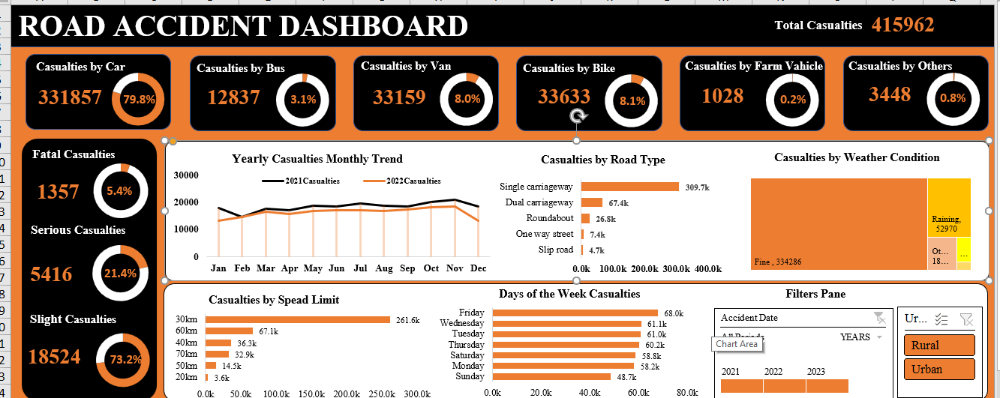

# Road Accident Analysis Dashboard with Excel

## Introduction

The World Health Organization reports that approximately 1.3 million lives are lost annually due to road traffic accidents, with an additional 20 to 50 million individuals suffering non-fatal injuries, some leading to disabilities. Factors contributing to these accidents include speeding, driving under the influence, inadequate road infrastructure, distracted driving, the failure to use safety equipment such as helmets and seat belts, weather conditions etc.

## Objectives

This project is an analysis aimed at assessing  the cause and predominant factors resulting to the frequency and severity of road accidents in Poland. The project aims to provide valuable insights to stakeholders; the Ministry of Transport, Road Transport Department, Emergency Services Department, Road Transport Corps, Transport Operators, Traffic Management Agencies, and the general public. These insights will inform decisions on how to mitigate and reduce the risk and severity of road accidents in Poland.

## Data Source

For this analysis, I used a synthetic dataset from **Kaggle**, comprising 306,440 rows and 21 data fields. 

**_Disclaimer_**: It is important to note that this dataset is not affiliated with any government agency or official stakeholder. The analysis was performed using **_Microsoft Excel_**

## Data Cleaning:
To ensure data accuracy, I initiated the cleaning process by applying filters to the fields, searching for blanks, duplicates, and typos. The accident index field was identified as the primary key for this dataset due to its dynamic nature with no typos, blanks, or duplicates.

#### Searching for Blanks:
While examining the dataset, I identified some blank rows in specific fields, such as Carriage Way (3 blank rows), Road Surface Condition (1534 blank rows), and Weather Conditions (6057 blank rows). I opted to retain these blank rows, as they did not significantly affect the project's objectives. In the Accident Severity field, I encountered the term "fetal," which was corrected to "fatal" as it was likely a typographical error.

#### Data Analysis and Visualization:
I utilized pivot tables and pivot charts for our analysis and visualization. I began by generating insights for Key Performance Indicators (KPIs) and created visualizations. To streamline chart creation, I copied and adjusted the data source for each insight.

I also created a pivot table and line chart to illustrate the monthly trends in accidents per year. We assessed the impact of road type on accidents by generating another pivot table and bar chart, taking into account the blank rows. To present accurate data, I added data labels to the chart, adjusting the number format as needed.

## Data Analysis/Question Answered

- Key Performance Indicator (KPI) - Total Casualty Count
- KPI's - Comprehensive analysis on total casualties and their proportion in relation to accident severity and casualties categorized by vehicle types.
- Monthly patterns illustrating a contrast in casualties between the current year and the previous year.
- Casualties categorized by Road Type
- Casualties categorized by Weather Conditions
- Casualties categorized by Speed Limits
- Casualties categorized by Days of the Week

## Findings/Results

- The combined total casualties reported in 2021 and 2022 amount to 415,692.
- Cars recorded the highest number of casualties, accounting for 331,857, which is approximately 79.8% of the total casualties.
- In terms of accident severity, "Slight" casualties had the highest count at 349,736, making up 84.1% of the total casualties.
- The latter half of the year had more casualties than the first half, with 2021 having a higher casualty count than 2022.
- Single carriageway accidents had the highest number of casualties by road type, while fine weather conditions were associated with 80.4% of the total casualties, making it the most common weather condition during accidents.
- Fridays had the highest number of casualties among the days of the week, and a 30km speed limit was associated with the highest number of casualties.
